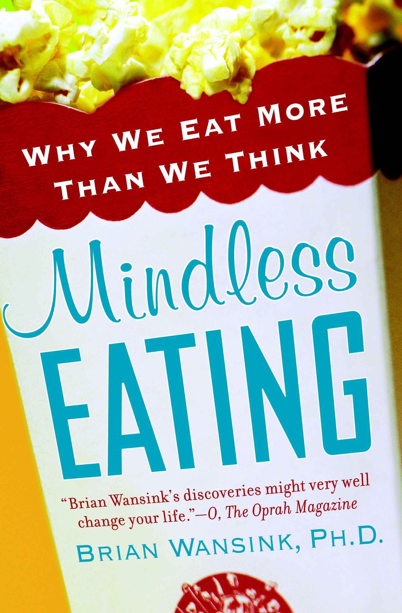
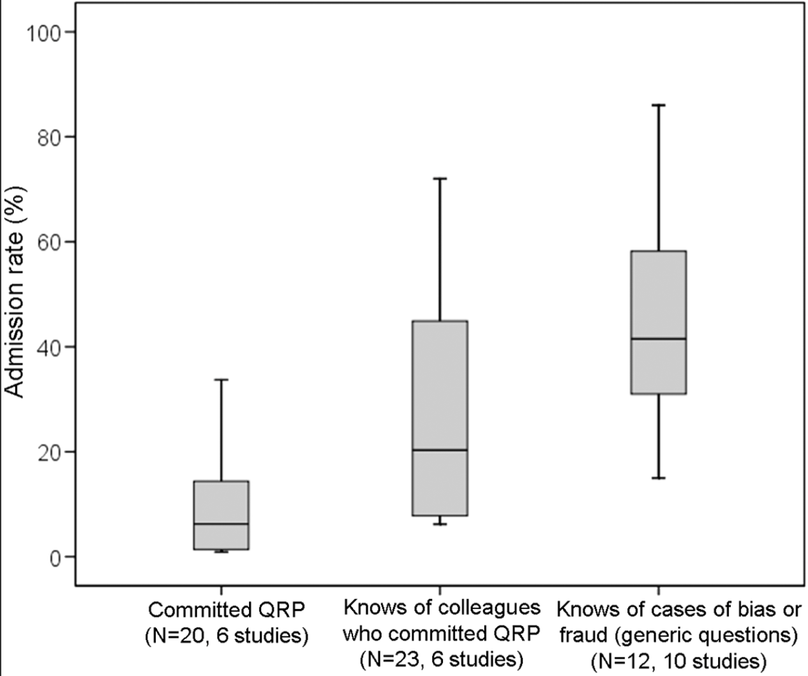
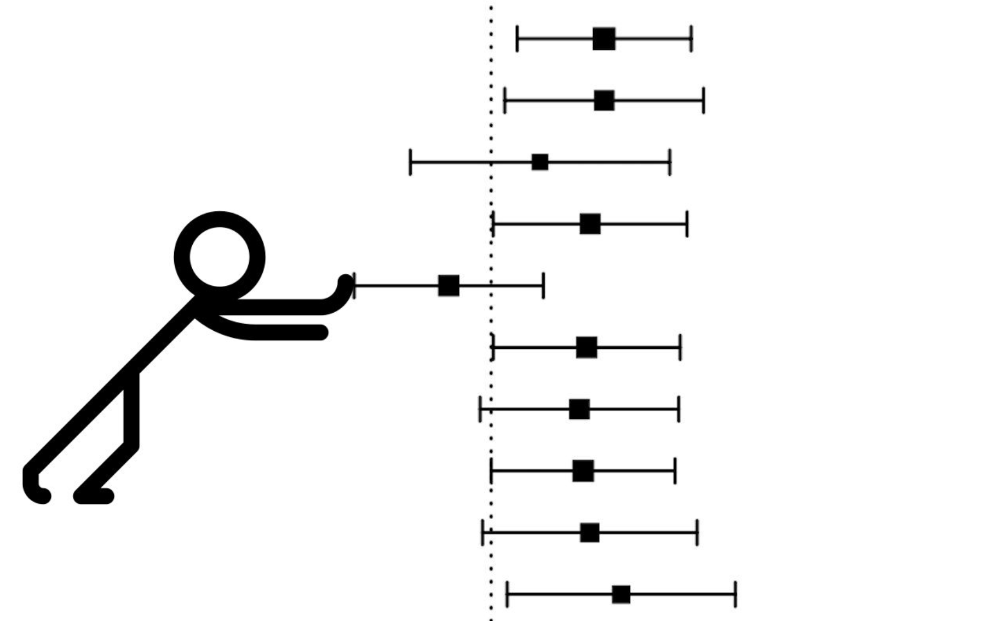
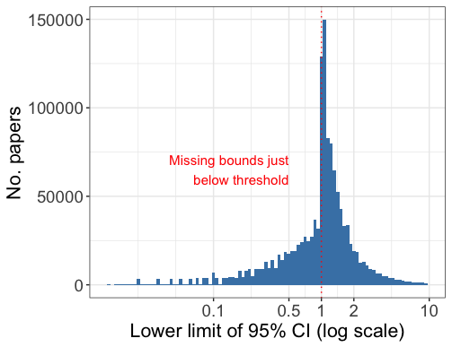
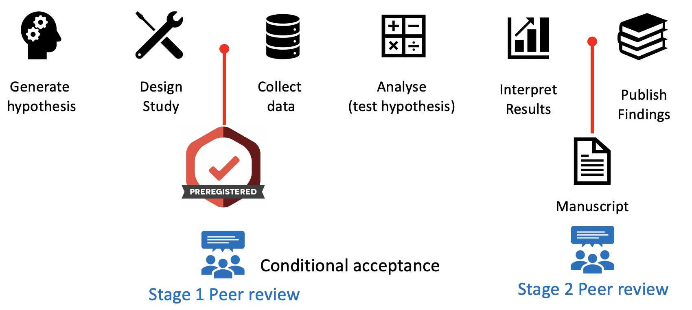
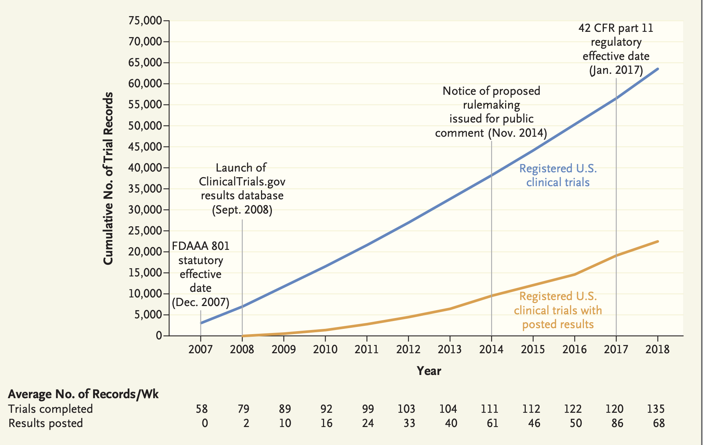
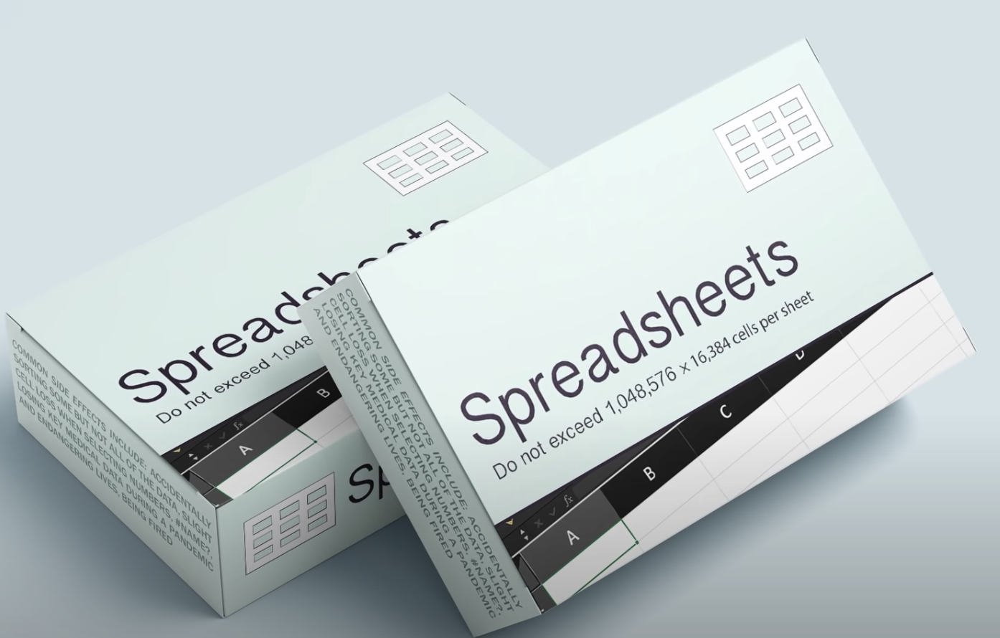
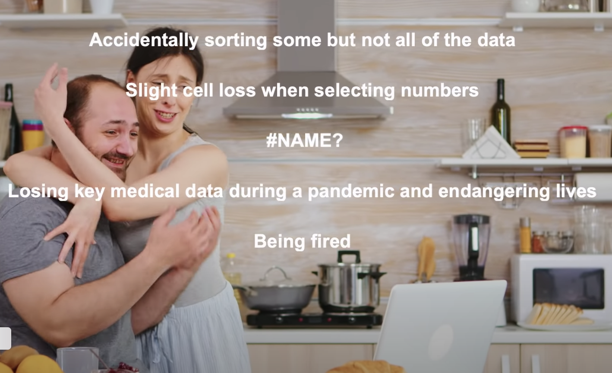
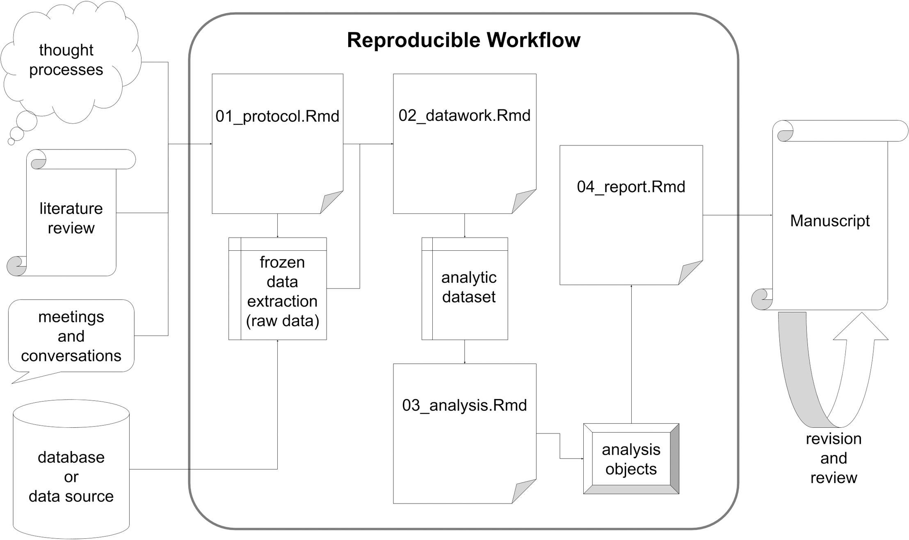

```{r setup, include=FALSE}
options(htmltools.dir.version = FALSE)
library(here)
library(tidyverse)
library(DiagrammeR)
library(xaringan)
library(leaflet)
library(ggplot2)
library(emojifont)
xfun::pkg_load2(c('tikzDevice', 'magick', 'pdftools'))
```

```{r, include=FALSE}
pdf2png = function(path) {
  # only do the conversion for non-LaTeX output
  if (knitr::is_latex_output()) return(path)
  path2 = xfun::with_ext(path, "png")
  img = magick::image_read_pdf(path)
  magick::image_write(img, path2, format = "png")
  path2
}
```

```{r xaringan-themer, include=FALSE}
library(xaringanthemer)
style_xaringan(text_color = "#000000", header_color = "#737373", text_font_size = "24px",  text_font_family = "'Lucida Sans'", header_font_google = google_font("Source Sans Pro"), header_font_weight="lighter", title_slide_background_color =  "#ffffff", title_slide_text_color = "#000000", link_color = "#0000ee", footnote_font_size = "0.5em")
```

background-image: url(images/wansink-bowl.png)
background-size: contain
class: inverse

--

.pull-left[

]

--
.pull-right[

]

---


.footnote[ https://www.foodpolitics.com/2007/11/brian-wansink-at-the-usda/]

---
.footnote[Archived post [here](https://web.archive.org/web/20170312041524/http:/www.brianwansink.com/phd-advice/the-grad-student-who-never-said-no).]

.pull-left[
*"I gave her a data set of a self-funded, failed study which had .red[null results]... I said, ‘This cost us a lot of time and our own money to collect. There’s got to be something here we can salvage because it’s a cool (rich & unique) data set.’ I had three ideas for potential Plan B, C, & D directions (since Plan A had failed)."* -blog, 2016
]

---
.footnote[Archived post [here](https://web.archive.org/web/20170312041524/http:/www.brianwansink.com/phd-advice/the-grad-student-who-never-said-no).]

.pull-left[
*"I gave her a data set of a self-funded, failed study which had .red[null results]... I said, ‘This cost us a lot of time and our own money to collect. There’s got to be something here we can salvage because it’s a cool (rich & unique) data set.’ I had three ideas for potential Plan B, C, & D directions (since Plan A had failed)."* -blog, 2016

Enterprising grad students found:
- impossible values
- incorrect ANOVA results
- dubious p-values

Wansink denied requests for access to the original data.
]

--

.pull-right[


Wansink resigned from Cornell in 2019.
]

---
class: center, middle, inverse

# .orange[**Why does this bother us?**]

---
### Mertonian Norms and Counternorms in Science
.footnote[ Merton (1942), Christensen et al. (2019)]
.pull-left[
### Norms
- *Universalism*: Evaluate research only on its merit.

- *Communality*: Openly share new findings.

- *Disinterestedness*: Motivated by the desire for knowledge and discovery.

- *Skepticism*: Consider all new evidence, even if it challenges their own work.
]

--

.pull-right[
### Counternorms
- *Particularism*: New knowledge from reputation or group.

- *Secrecy*: Protect own findings for private gain.

- *Self-interestedness*: Colleagues are competitors.

- *Dogmatism*: Protecting one's own findings.
]

---
class: center, top, inverse
# .background[x]

# .orange[**How do we know that science isn't working?**]

--

# .orange[**(1) Ask scientists.**]

---
.footnote[ Christensen et al. (2019) surveyed 3247 US researchers funded by NIH]
.left-column[
.right[
### Norm support:
### "In theory"
#### .white[x]
### "Me"
####.white[x]
### .blue["Others"]
]]

.right-column[

]

---
.footnote[Fanelli *PLoS ONE* (2011)]
.left-column[
### Scientists admit to engaging in questionable research practices.


]
.right-column[
.center[

]]

---
.footnote[Baker *Nature* (2018)]
.left-column[
## Scentists think there is a "reproducibility" crisis

### or a "slight" crisis?  `r emo::ji("thinking_face")`
]
.right-column[
.center[

]]

---
class: center, top, inverse
# .background[x]

# .orange[**How do we know that science isn't working?**]

--

# .orange[**(2) Look at what we are doing.**]

---
## Potential sources of **systemic** bias in published research
.left-column[
```{r, echo=F, out.height="100%", out.width="100%"}
ggplot() + geom_fontawesome("fa-exclamation-triangle", color='red') + theme_void()
```
]

.right-column[
### Deceipt
#### Fraud, manipulation, fabrication
### Significance chasing
#### P-hacking, publication bias, file drawers, broken peer review
### Conflicts of interest
#### Financial, self-interest, careerism, bad incentives
]

---
## Integrity Problems
### .orange[Confirmation bias, dogmatism]

.center[

]

---
## Integrity Problems
### .orange[Fraud, manipulation, fabrication, etc.]

.center[

]

---
.left-column[
## .gray[Integrity Problems]
### .orange[P-hacking, fishing, data dredging, etc.]
]

.right-column[

]

---
## Integrity Problems
### .orange[P-hacking, fishing, data dredging, etc.]

.center[

]

---
## Integrity Problems
### .orange[Careerism, attention seeking, least publishable unit, etc.]

.center[

]

---
## Integrity Problems
### .orange[Lack of transparency]

.center[
# .white[x]
# .red[**This entire *research plan* was an email.**]
]

---
.pull-left[
# A lot of irreproducible or unreliable research stems from Null Hypothesis Significance Testing
]

.pull-right[

]


.footnote[Lash (2017), image credit:[twitter]( https://mobile.twitter.com/wviechtb/status/1228327958810648576/photo/1)]

---
class: top, center
# .white[x]
# .orange[**How do we know there is p-hacking?**]

--

# **(1) Look at what people are doing.**

---
.footnote[ https://www.ahajournals.org/doi/abs/10.1161/jaha.116.004880]
.left-column[
Two estimates:
- HR=0.90, 95%CI: 0.81, 0.99    .blue["Significantly lower"]

- HR=0.89, 95%CI: 0.78, 1.00009 .red["No difference"]
]

.right-column[
````{r, echo=F, out.width=1000}

```
]

---
class: top, center
# .white[x]
# .orange[**How do we know there is p-hacking?**]

# (1) Look at what people are doing.
# **(2) Everything is significant**

---
background-image: url(images/chavalarais-fig3.png)
background-size: 70%
class: left, top

90+% of biomedical papers with *p*<0.05, 1990-2015

.footnote[ Chavalarais et al. (2013)]

---
class: top, center
# .white[x]
# .orange[**How do we know there is p-hacking?**]

# (1) Look at what people are doing.
# (2) Everything is significant.
# **(3) Maldistribution of p-values.**

---
.left-column[
.footnote[ Gotzsche (2006)]
Missing p-values just *above* 0.05.

True for medicine, economics, psychology, political science, many other disciplines.
]

.right-column[
P-values from 260 RCTs
````{r, echo=F, out.width=700}

```
]

---
.left-column[
.footnote[ Barnett and Wren [(2019)](https://bmjopen.bmj.com/content/bmjopen/9/11/e032506.full.pdf)]
### Won't 95% confidence intervals help?
No.

Researchers still hack until "significant."
]

.right-column[
.center[Nearly 1,000,000 RR 95% CIs from PubMed:]
````{r, echo=F, out.width=700}

```
]

---
class: middle, center
# NHST also leads to missing evidence and publication bias

---
.footnote[ Turner et al. (2008)]

.pull-left[
###  Missing evidence
Negative studies of antidepressents less likely to be published. 

Impacts regulatory decisions.

Caused by researchers, peer review, journal editors, funders.
]

.pull-right[
.center[


]]

---
### Large scale replication efforts find diminished effects.
.pull-left[
#### In Psychology
```{r,  echo=F, out.width = 650}
 
```
]

.pull-right[
#### In Economics
```{r,  echo=F, out.width = 650}
 
```
]

.footnote[ Nosek et al. (2017), Camerer et al. (2016)]


---
### If we wanted to reproduce, often the materials aren't there
.center[
```{r, echo=F, out.width=700}

```
]

.footnote[ Miyakawa *Molecular Brain* (2020) 13:24]

---
class: center, middle, inverse

# .orange[**We have abundant evidence of integrity problems in existing science.**]

--

# .orange[**Open science can help**]

---
class: center, top, inverse
# .background[x]

# .orange[**Great. What is it?**]

--

# .orange[**Open science aims to provide tools and incentives to make science more transparent, reproducible, and reliable.**]

---
# How can open science help?
.left-column[
.right[


]]
.right-column[
## 1. Transparent Design
#### .white[x]
## 2. Reproducible Workflow
#### .white[x]
## 3. Open Dissemination
]


---
class: center, top, inverse
# .orange[**Design Solutions**]

.left[
## .orange[**Preregistration/pre-analysis plans**]
## .orange[**Reporting guidelines**]
]

---
# What is study preregistration?
.left-column[
### A detailed study proposal that is:
]

.right-column[
### Time stamped
#### Records and publicizes time and date.


### Read-only
#### Can't be modified.

### Registered prior to data collection/access
#### Robust to fieldwork, data snooping.
]

---
# What is a pre-analysis plan?
.left-column[
```{r, echo=F}

# ggplot() + geom_fontawesome("fa-pencil-square-o", color='steelblue') + theme_void()
```
]

.right-column[
- Detailed description of research design and data analysis plans, submitted to a registry before looking at the data.

- Helps to tie your hands for data analysis (address researcher degrees of freedom, etc.).

- Distinguish between confirmatory and exploratory analysis.

- Increases the credibility of research.

- Transparent methods make it easier for others to build on your work.

- .red[Not a straightjacket.] Transparent deviations acceptable.
]

---
class: center, top, inverse
# .background[**X**]
# .orange[**Registration is useful**]

---
.footnote[redrawn from Kaplan and Irwin [(2015)](https://journals.plos.org/plosone/article?id=10.1371/journal.pone.0132382)]

.left-column[
In 2000 NHLBI required the registration of primary outcome on ClinicalTrials.gov for all their grant-funded activity.
]

.right-column[
```{r, echo=F, message=F}
d <- read_csv("images/kaplan-2015-data.csv",
  col_names=c("Year", "RR", "type"), col_types = "ddf")
p <- ggplot(d, aes(x=Year, y=RR, colour=type)) + geom_vline(xintercept=2000) +  geom_point(size=5) + geom_curve(aes(x = 2006, y = 1.5, xend = 2005, yend = 1.25), curvature=0.2, arrow = arrow(length = unit(0.03, "npc")), colour="grey60") + annotate("text", label = "Increase in\nnull findings.", x = 2006, y = 1.8, size = 9, colour = "gray60", hjust=0) + geom_curve(aes(x = 1999, y = 2, xend = 1999.9, yend = 2), curvature=0, arrow = arrow(length = unit(0.01, "npc")), color="grey20") + annotate("text", label = "Registration\nrequired", x=1999, y=2, size=5, color="grey20", hjust=1) + scale_y_log10(limits=c(0.1,2)) + ylab("RR (log scale)") + scale_color_manual(name="Finding", values=c("grey60", "#6ca0f5", "#d6463a")) + theme_classic() + theme(plot.title = element_text(size = 18, face = "bold"), plot.subtitle = element_text(size=16)) + theme(axis.text.x = element_text(size = 16, colour = "grey20"), axis.title.y=element_text(size=16, angle=90, colour="grey20"), axis.title.x=element_text(size=20, colour="grey20"), axis.text.y = element_text(size = 16, colour="grey20"), legend.position=c(0.9, 0.25), legend.text = element_text(size=14), legend.title = element_text(size=16), panel.grid.major.y = element_line(linetype="dotted", colour="grey60"), panel.grid.major.x = element_line(colour="white"), panel.grid.minor = element_line(colour="white")) + theme(axis.line.x=element_line(colour="grey60"), axis.line.y=element_line(colour="grey60"), axis.ticks = element_blank())
ggsave("images/kaplan-plos-redraw.png", plot=p, width=11, height=7)

```
]

---
class: center, top, inverse
# What if my results are null?

# You showed us that they won't get published!

# I have to make rent, you know.

---
## Emphasis on design: .red[Registered Reports]


.footnote[ Lee (2019)]

---
## Emphasis on design: .red[Registered Reports]


.footnote[ Lee (2019)]

---
.footnote[Allen & Mehler, *PLoS Biology* [(2019)](https://journals.plos.org/plosbiology/article?id=10.1371/journal.pbio.3000246)]

.left-column[
### RRs in Psychology

Little difference between 'replication' studies and 'novel' studies.

Big difference from non-registered studies.
]


.right-column[
.center[

]]

---
class: center, top, inverse
# .background[**X**]
# .orange[**Registration is useful**]
# .orange[**but not sufficient**]

---
.footnote[Zarin *NEJM* (2019)]
.center[
A majority of registerd RCTs still not reported.

]
---
class: center, top, inverse
# .orange[**Analytic Solutions**]

.left[
## .orange[**Workflow Management**]
## .orange[**Documentation**]
## .orange[**Literate Programming**]
## .orange[**Version Control**]
## .orange[**Dynamic Documents**]
]

---
.footnote[ Boddy (2016), Ziemann (2016)]

.left-column[
Tools have consequences
.center[
*SEPT2* gene
## `r emo::ji("point_down")`

# `r emo::ji("point_down")`
2-Sep

]]

..right-column[
.center[

]]

---
# More recently...
.pull-left[


]

.pull-right[
Are Spreadsheets® right for you? Side effects may include:


]

.footnote[ Sources: The Guardian [(2020-10-06)](https://www.theguardian.com/politics/2020/oct/05/how-excel-may-have-caused-loss-of-16000-covid-tests-in-england), [YouTube](https://www.youtube.com/watch?v=aBoKwArgC3A)]

---
.footnote[Krieger et al. PLoS ONE [(2019)](https://journals.plos.org/plosone/article?id=10.1371/journal.pone.0212390)]

.left-column[
#### .blue[Modern workflow]
- Code and data separated.

- Raw data never altered.

- Figures and tables created by scripts.

- No copy/paste

- Results + text in a single *dynamic* document.
]

.right-column[
.center[

]]

---
class: center, top, inverse
# .orange[**Dissemination Solutions**]

.left[
## .orange[**Replication Files**]
## .orange[**Sharing**]
]

---
# Replication files provide the 'recipe' for reproducing your results.

.left-column[
```{r, echo=F, out.height="100%", out.width="100%"}
ggplot() + geom_fontawesome("fa-clone", color='#f5bc6c') + theme_void()
```
]

.right-column[
### Facilitate reproducibility
#### Anyone can reproduce your tables and figures.

### Detects errors
#### Coding is hard. We all make mistakes.

### Extends work
#### Probes reliability of findings, answers new questions.
]

---
background-image: url(images/greenstone-abstract.png)
background-size: contain
class: center, middle

--


---
.footnote[ *Am Econ Rev* (2012)]
.center[

]

Fisher et al. found:

1. .blue[data and coding errors] in DG's weather data, agricultural data, and the construction of climate-change scenarios;
2. the particular climate change scenario which is used for impact predictions; and
3. standard errors that are biased due to spatial correlation.

"Correcting DG's data and coding errors makes predictions for climate-change
impacts .red[unambiguously negative] in all but one specification."

---
.footnote[ *Am Econ Rev* (2012)]


---
# Why share?
.left-column[

]
.right-column[
### Credibility
#### Others can reproduce or interrogate your findings.

### Social Good
#### Resource for other questions and new ideas.

### Changing norms
#### Professional norms are insufficient to change behavior.
]

---
# Not everything can (or should) be shared
### Spectrum for sharing sensitive material:

.footnote[ Source: Jennifer Sturdy (https://osf.io/5yq4u/)]

---
### A reproducible path forward: Reminaging the research lifecycle?


.footnote[ Policy Design & Evaluation Lab (2017)]

---
# Challenges
.left-column[
```{r, echo=F, out.height="100%", out.width="100%"}
ggplot() + geom_fontawesome("fa-bridge", color='#f5bc6c') + theme_void()
```
]

.right-column[
### Open science adds work
#### Competes with incentives, career, and time demands

### Open materials are open to all
#### Biases still present (see concerns about EPA rulemaking changes)

### Open science $\neq$ true science
#### Only a minimum standard for transparency.
]

---
class: center, middle, inverse
# .orange[**Preregistered, planned studies with completely transparent methods and open protocols, data, and code may be bad**]

---
class: center, middle, inverse
# .orange[**Open Science Does Not Mean True Science**]

---
# Summary points: Why Embrace Open Science?
## 1. To contribute to improving scientific integrity.
## 2. To move professional norms in a positive direction.
## 3. To improve the quality of your own reserach.

---
background-image: url(images/mcgill-university.jpg)
background-size: contain
class: center, middle
#### .white[sam.harper@mcgill.ca]
#### .white[@sbh4th]


